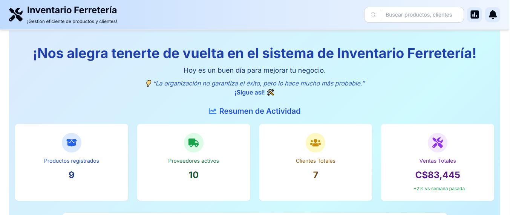
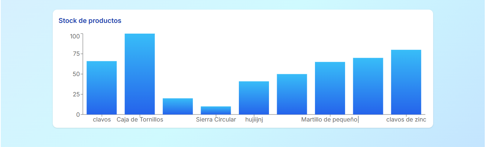
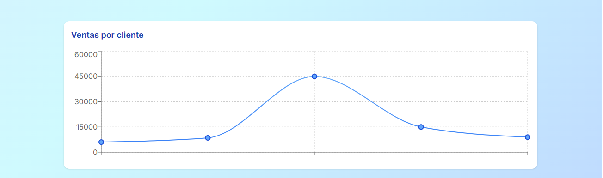
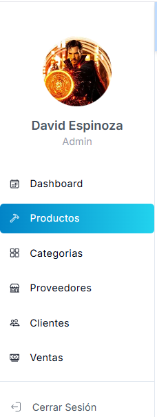
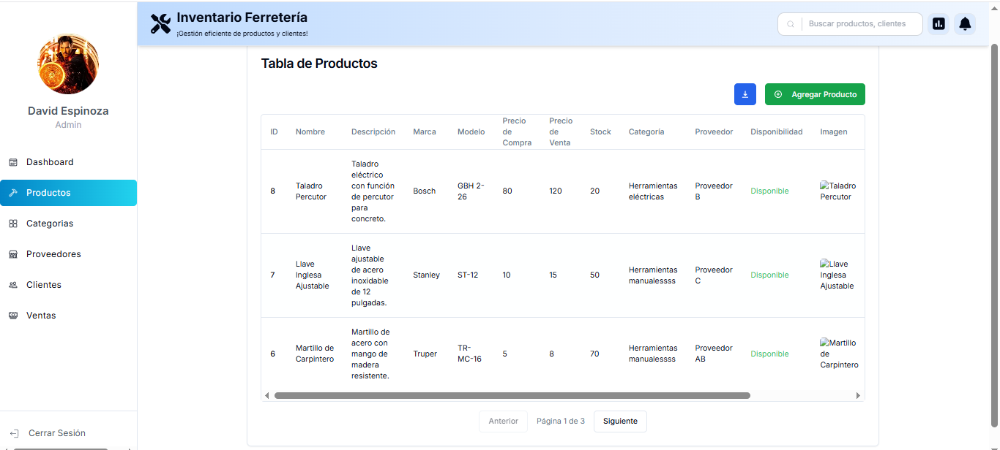
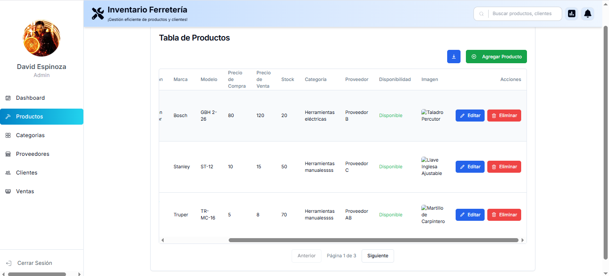

A progressive Next.js framework for building efficient and scalable inventory management applications.

# Inventario Ferretería Frontend

## Descripción
El sistema de Inventario Ferretería es una aplicación web diseñada para gestionar productos, categorías, proveedores, clientes y ventas de manera eficiente. Este proyecto utiliza *Next.js* como framework de frontend, junto con *TailwindCSS* para el diseño, *SweetAlert2* para las notificaciones interactivas y otras tecnologías modernas para garantizar una experiencia de usuario fluida.

---

## Requisitos Previos

Antes de comenzar, asegúrate de tener instalados los siguientes requisitos en tu sistema:

- *Node.js* 22.14.0
- *npm* 11.3.0
- *Backend* del proyecto (Inventario Ferretería Backend) configurado y ejecutándose en http://localhost:4000

---

## Instalación y Configuración

Sigue estos pasos para clonar, instalar y configurar el proyecto:

### 1. Clonar el Repositorio
bash
git clone https://github.com/tu-usuario/inventario-frontend.git
cd inventario-frontend

### 2. Instalar Dependencias
bash
npm install

### 3. Configurar Variables de Entorno
Crea un archivo .env en la raíz del proyecto y agrega las siguientes variables de entorno:

properties
NEXTAUTH_SECRET=**********************
NEXTAUTH_URL=http://localhost:3000

NEXT_PUBLIC_API_URL=http://localhost:4000

---

## Ejecución del Proyecto

### Modo Desarrollo
Para iniciar el servidor de desarrollo, ejecuta:
npm run dev

Esto iniciará el proyecto en [http://localhost:3000].

### Modo Producción
Para construir y ejecutar el proyecto en modo producción:
npm start

---

## Uso del Sistema

### Funcionalidades Clave
- *Gestión de Productos*: Generar reportes, agregar, editar, eliminar y listar productos.
- *Gestión de Categorías*: Generar reportes, agregar, editar, eliminar y listar categorías.
- *Gestión de Proveedores*:Generar reportes, agregar, editar, eliminar y listar proveedores.
- *Gestión de Clientes*: Generar reportes, agregar, editar, eliminar y listar clientes.
- *Gestión de Ventas*: Registrar ventas y generar reportes.

#### Dashboard

El dashboard muestra un resumen de la actividad, incluyendo productos registrados, proveedores activos, clientes totales y ventas totales.

### Sidebar

El sistema cuenta con un menú lateral desplegable que mejora significativamente la experiencia del usuario, proporcionando una navegación intuitiva y rápida entre las diferentes secciones de la aplicación. Este diseño permite acceder fácilmente a los módulos principales sin recargar la vista ni saturar la interfaz.

#### Gestión de Productos

Pantalla para listar, agregar, editar y eliminar productos.

---

## Endpoints Clave

Aunque este es el frontend, aquí hay algunos endpoints clave que utiliza el sistema:

- *POST /auth/login*: Autenticación de usuarios.
- *POST /auth/register*: Registro de nuevos usuarios.
- *GET /products*: Listar productos.
- *POST /products*: Agregar un nuevo producto.
- *PUT /products/:id*: Editar un producto existente.
- *DELETE /products/:id*: Eliminar un producto.

---

## Tecnologías Usadas

### Frameworks y Librerías Principales
- *Next.js*: Framework de frontend.
- *React*: Biblioteca para interfaces de usuario.
- *TailwindCSS*: Framework de diseño.
- *SweetAlert2*: Notificaciones interactivas.
- *Axios*: Cliente HTTP para consumir APIs.
- *React Hook Form*: Manejo de formularios.
- *Recharts*: Gráficos y visualización de datos.

### Herramientas de Desarrollo
- *TypeScript*: Tipado estático para JavaScript.
- *ESLint*: Linter para mantener la calidad del código.
- *PostCSS*: Herramienta para transformar estilos CSS.
- *Tailwind Merge*: Utilidad para combinar clases de TailwindCSS.
- *TailwindCSS Animate*: Animaciones predefinidas para TailwindCSS.

### Otras Dependencias
- *Lucide React*: Iconos modernos para React.
- *Chart.js*: Gráficos interactivos.
- *Radix UI*: Componentes accesibles y estilizados.
- *clsx*: Utilidad para manejar clases condicionales.

